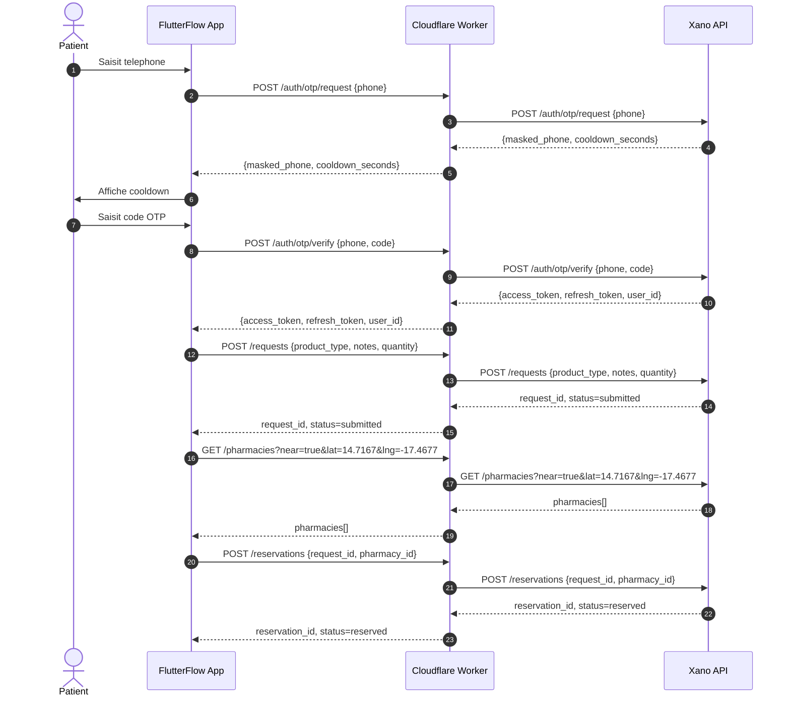
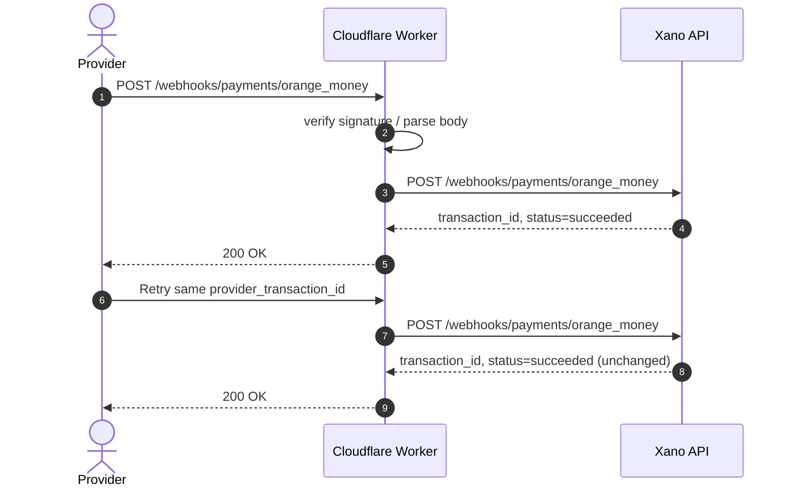
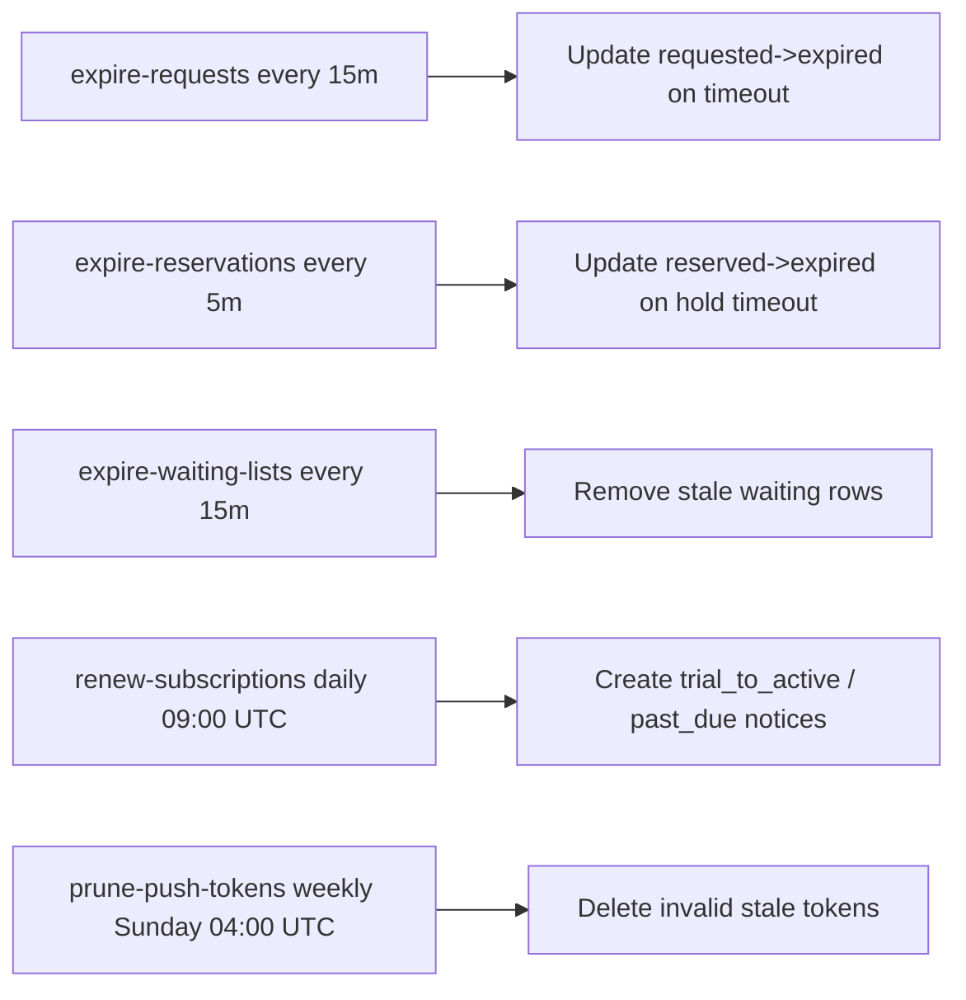
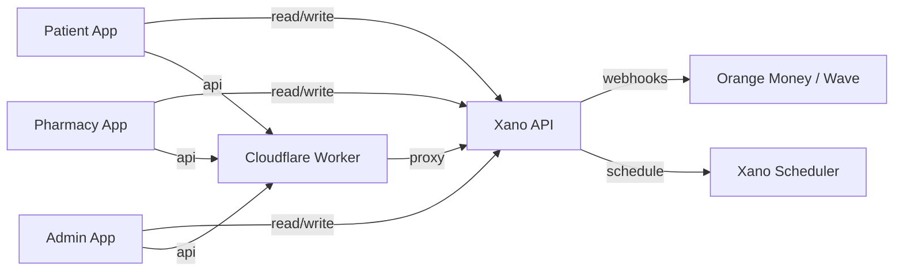

# System Architecture Diagrams — PharmaConnect v2.0

Use these Mermaid diagrams in docs, PRs, and onboarding.

## E2E: OTP + request + reservation

## Payment webhook idempotency

## Scheduler jobs

## Data ownership boundary

